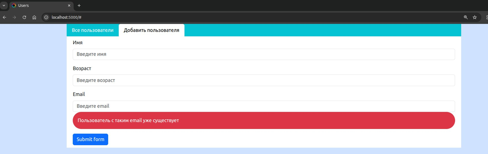

# База пользователей 
## Начало работы: 

Чтобы запустить приложение у себя, локально, нужно: 
1. Склонировать репозиторий 
2.  Перейти в папку Back 
3.  Выполнить в консоли(находясь в папке Back) pip install -r requirements.txt 
4. Запустить backed командой: python main.py
5. Как только бекенд запустится, переходим в папку frontend
6. Там в консоли выполняем команду npm install 
7. После установки всех зависимостей выполняем команду npm start. Готово, переходим по ссылке http://localhost:5000(она будет в терминале после заупска фронтенда). 

## Само приложение:

 1. По пути http://localhost:5000 открывается стартовая  страница 
 2.  При нажатии на кнопку "Все пользователи" открывается список всех пользователей в БД 
 3. При нажатии на конкретную строку выводится подробная информация по выбранному пользователю  
 4. При нажатии на кнопку "Добавить пользователя" открывает форма добавления нового пользователя 
 5. Обработка ошибок: При вводе слишком короткого имени - будет ошибка   

 6. Обработка ошибок: Правильное имя, но невалидный возраст - ошибка

 7. Обработка ошибок: Валидные имя и возраст, но невалидный emial - подсказка
 8. Если пользователь с таким email уже есть - ошибка 

 9. При удачном добавлении пользователя - сообщение  

 10. Все, кто успешно добавлен - отображаются во вкладке "Все пользователи" без обновления страницы 
